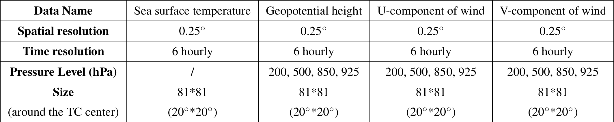

# TropiCycloneNet-Dataset

## Overview

This project introduces the details of the **TropiCycloneNet Dataset**  ($TCN_D$), a comprehensive dataset for studying tropical cyclones (TCs). It includes $Data_{1d}$, $Data_{3d}$, and **environmental data (*Env-Data*)** collected for various tropical cyclones in the major oceanic regions from 1950 to 2023. The dataset is aimed at providing valuable insights for tropical cyclone research and predictive modeling.

## Download

We offer two download options for the **TropiCycloneNet Dataset**  ($TCN_D$):

- **Full Dataset**: Contains tropical cyclone data from 1950 to 2023, across six major oceans. The data size is approximately `25.7 GB`.
    - [Full Dataset](https://drive.google.com/file/d/1BUAab0OYyiArbraQHu2oMoj_jF-nNUxT/view?usp=sharing)
  
- **Test Subset**: A smaller subset of data from 2017 to 2023, intended for testing purposes. The data size is approximately `3.34 GB`.
    - [Test Subset](https://drive.google.com/file/d/1Xx2rzH6ztSGLTUR9EZkfDz5mQHsvhHsi/view?usp=sharing)
      
More download options will be added in the future, such as downloading by ocean region, by year, etc.

## Check Data

We provide code to read and visualize $Data_{1d}$, $Data_{3d}$, and *Env-Data*. Researchers can flexibly use our dataset and visualize different types of data using the provided scripts.

### Steps to Use the Dataset

1. **Download and Extract the Dataset**: 
   - Download and extract the $TCN_D$ dataset to your desired path (`dataset_path`).
   
2. **Set Up the Environment**:
   - Install Python 3.7 and the necessary dependencies:
   
     ```bash
     pip install netCDF4==1.5.8
     pip install matplotlib==3.5.3
     pip install pandas==1.1.1
     pip install numpy==1.19.0
     ```
   
3. **Run the Code**:
   - After setting up the environment, run the `read_TCND.py` script:
   
     ```bash
     python read_TCND.py dataset_path TC_name TC_date area train_val_test
     ```
   
     Here:
     - `dataset_path` refers to the path where the dataset is located.
     - `TC_name` is the name of the tropical cyclone you wish to examine.
     - `TC_date` is the specific date and time of the cyclone in `YYYYMMDDHH` format.
     - `area` specifies the ocean region where the cyclone occurred (e.g., WP for Western Pacific, EP for Eastern Pacific, etc.).
     - `train_val_test` indicates whether the queried typhoon belongs to training, validation, or test set (train or val or test).

   - After running the script, you will find visualized images of **Data1D**, **Data3D**, and **Env-Data** in the current directory. The images will be named `Data1D.png`, `Data3D.png`, and `Env-Data.png`.

## Visualization Example

### Visualizing All Data

1. **Get Details for $Data_{3d}$**:


   The **3D data** covers the **20° x 20° region** around the tropical cyclone's center. The spatial resolution is **0.25°**, and the temporal resolution is **6 hours**. We collect **Geopotential Height (GPH)**, **U-component of wind**, and **V-component of wind** at **200 hPa, 500 hPa, 850 hPa**, and **925 hPa** pressure levels. **Sea Surface Temperature (SST)** data is also included in the **Data3D** set.

3. **Example of $Data_{1d}$, $Data_{3d}$, and *Env-Data***:
   The following command visualizes the tropical cyclone data for a specific time (`2001101418` for `Haiyan` in the Western Pacific region):

   ```bash
   python read_TCND.py dataset_path Haiyan 2001101418 WP train
   ```

    After running the script, you will see the corresponding cyclone **Data1D**, **Data3D**, and **Env-Data** visualizations.
    
    ### Examples of $Data_{3d}$:
    
   
    We crop the data covering a **20° x 20°** region around the TC center. The spatial resolution is **0.25°**, and the time resolution is **6 hours**. We collect **Geopotential Height (GPH)**, **U-component of wind**, and **V-component of wind** at **200 hPa**, **500 hPa**, **850 hPa**, and **925 hPa** pressure levels. **Sea Surface Temperature (SST)** data is also included in the **Data3D** set.
    
    ### Examples of $Data_{1d}$:
    

   The bolded content in the first row of the figure represents some information about the typhoon Haiyan at 2001101418 that we want to examine.
    - **ID**: Time step of the TC.
    - **LONG**: Longitude of the TC center (with a precision of **0.1°E**).
    - **LAT**: Latitude of the TC center (with a precision of **0.1°N**).
    - **PRES**: Minimum pressure (hPa) near the TC center.
    - **WND**: Two-minute mean maximum sustained wind (MSW; m/s) near the TC center.
    - **YYYYMMDDHH**: Date and time (UTC) of the TC event.
    - **Name**: Name of the TC.
    
    The **Data1D** is normalized using specific rules to make it suitable for **deep learning (DL)** methods to extract useful information.
    
    
    ### Examples of *Env-Data*:
    
   
    The **Env-Data** includes the following attributes:
    
    - **Movement Velocity**: The movement velocity of the tropical cyclone.
    - **Month**: Month of occurrence.
    - **Location Longitude and Latitude**: The relative location on Earth.
    - **24-hour History of Direction**: The movement direction of the cyclone in the past 24 hours.
    - **24-hour History of Intensity Change**: The intensity change of the cyclone in the past 24 hours.
    - **Subtropical High Region**: Extracted from **500 hPa Geopotential Height (GPH)** data. This variable is processed to make the data more suitable for input to **DL models**.
    
## Additional Experiments    


## License

This project is licensed under the MIT License - see the [LICENSE](LICENSE) file for details.

## Acknowledgments

We would like to acknowledge the support of the research community and the institutions that contributed to the development of this dataset. The **TropiCycloneNet Dataset** has been designed for academic and research purposes in tropical cyclone studies.

---

Feel free to reach out with any questions or comments regarding the **TropiCycloneNet Dataset** or how to use this project.


## Citing TropiCycloneNet

```
@article{Huang2025,
  author    = {Huang, Cheng and Mu, Pan and Zhang, Jinglin and Chan, Sixian and Zhang, Shiqi and Yan, Hanting and Chen, Shengyong and Bai, Cong},
  title     = {Benchmark dataset and deep learning method for global tropical cyclone forecasting},
  journal   = {Nature Communications},
  volume    = {16},
  number    = {1},
  pages     = {5923},
  year      = {2025},
  publisher = {Nature Publishing Group},
  doi       = {10.1038/s41467-025-61087-4},
  url       = {https://doi.org/10.1038/s41467-025-61087-4},
  issn      = {2041-1723}
}
```
